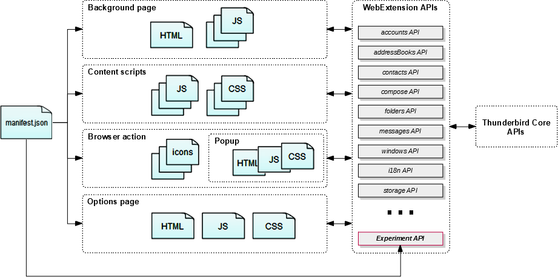

# A Guide to MailExtensions

### Overview

MailExtensions are based on the WebExtension technology, which is also used by many web browsers. Such an extension is a simple collection of files that modifies Thunderbirds appearance and behavior. It can add user interface elements, alter content, or perform background tasks. MailExtensions are created using standard JavaScript, CSS and HTML. Interaction with Thunderbird itself, like adding UI elements or accessing the users messages or contacts is done through special WebExtension APIs.

As Thunderbird is based on the same code base as Firefox, we can reuse many of the WebExtension APIs provided by Firefox. Thunderbird of course requires additional interfaces to messenger specific functions. These additional APIs are also WebExtension APIs and are sometimes called MailExtension APIs, to indicate their dedication to Thunderbird.

You can find detailed information about MailExtensions here: 

* [Hello World MailExtension example](https://developer.thunderbird.net/add-ons/examples/hello-world-add-on)
* [Our sample-extensions repository](https://github.com/thundernest/sample-extensions/tree/master/experiment)
* [MailExtensions API documentation ](https://thunderbird-webextensions.readthedocs.io/)

Unlike older legacy extensions, MailExtensions access functionality through stable WebExtension APIs and do not have direct access to Thunderbird's internal components or UI elements. Consequently, MailExtensions are less likely to break and do not need frequent and complex updates when Thunderbird internals change.


All turquoise elements in the above diagram are limited to WebExtension APIs.


#### Experiment APIs

The current set of WebExtension APIs is not yet sufficient, many areas of Thunderbird are not accessible through these APIs. While we are working on improving the situation, you can create your own API, register it in your `manifest.json` file and use it in your extension like any other WebExtension API.

These Experiment APIs have access to the same functions, components and UI elements as Thunderbird itself. They allow to experiment with new WebExtension APIs, as a step towards adding those APIs to Thunderbird. Learn more about them here:

* [WebExtension Experiments documentation](https://thunderbird-webextensions.readthedocs.io/en/68/how-to/experiments.html)
* [Example in our sample-extensions repository](https://github.com/thundernest/sample-extensions/tree/master/experiment) 

Currently and for the foreseeable future \(years\) Experiments can be used in extensions released to the general public. In the meantime, we will be dedicated to API development and to improve the situation for add-on developers. If you have created an Experiment API which you think is a good fit for general use in Thunderbird, [tell us about it](https://developer.thunderbird.net/add-ons/community).

The community is currently discussing, if support for Experiment APIs should be disabled at some time or not. If at all, we will only start considering this, if the API situation has greatly improved. 

If you need an API that does not exist yet, please [tell us about it](https://bugzilla.mozilla.org/enter_bug.cgi?product=Thunderbird&component=Add-Ons%3A+Extensions+API). 

### Creating a MailExtension



