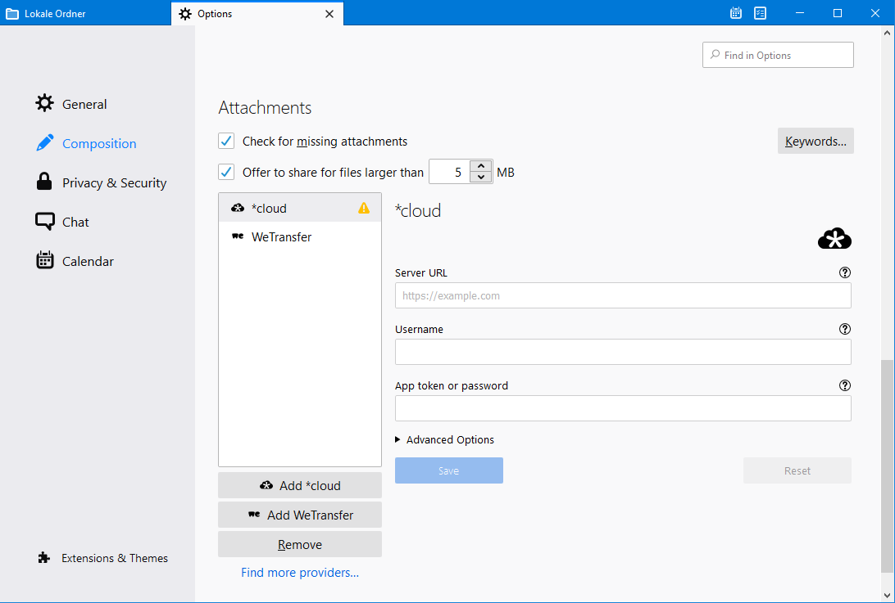

# Supported UI Elements

## Browser Action

A browser action adds a button to Thunderbird's main toolbar:


It is controlled by the `browser_action` manifest key in the extension's `manifest.json` file:

```javascript
"browser_action": {
    "default_title": "Restart",
    "default_icon" : "restart.png",
    "default_popup": "browser_popup.html"
}, 
```

If a `default_popup` is defined, a popup will be opened and the defined html page will be loaded, when the button is clicked. Additionally, you can use the [`browserAction`](https://webextension-api.thunderbird.net/en/latest/browserAction.html) API in your background script to interact with the button to modify _badge text_, _icon_, _title_ or its _enabled state_.

## Compose Action

A compose action adds a button to the toolbar of the composer window:


It is controlled by `compose_action` manifest key in the extension's `manifest.json` file:

```javascript
"compose_action": {
    "default_title": "Expand lists",
    "default_icon" : "lists.png",
    "default_popup": "compose_popup.html"
}, 
```

If a `default_popup` is defined, a popup will be opened and the defined html page will be loaded, when the button is clicked. Additionally, you can use the [`composeAction`](https://webextension-api.thunderbird.net/en/latest/composeAction.html) API in your background script to interact with the button to modify _badge text_, _icon_, _title_ or its _enabled state_.

## Message Display Action

 A message display action adds a button to the toolbar of the message view window:


It is controlled by the `message_display_action` manifest key in the extension's `manifest.json` file:

```javascript
"message_display_action": {
    "default_title": "Copy Patch",
    "default_icon" : "patch.png",
    "default_popup": "message_popup.html"
	},
```

If a `default_popup` is defined, a popup will be opened and the defined html page will be loaded, when the button is clicked. Additionally, you can use the [`messageDisplayAction`](https://webextension-api.thunderbird.net/en/latest/messageDisplayAction.html) API in your background script to interact with the button to modify _badge text_, _icon_, _title_ or its _enabled state_.

## CloudFile Provider Configuration

Thunderbird supports cloud providers to upload large attachments to a server, instead of attaching them directly to the email. Extensions can register such cloud providers using the [`CloudFile`](https://webextension-api.thunderbird.net/en/latest/cloudFile.html) API. These providers can be managed in Thunderbird's Composition options:



## Menu Items

The [`menus`](https://webextension-api.thunderbird.net/en/latest/menus.html) API allows modifying Thunderbird's menus by adding or overriding menu items. The menu items can be added to different menus based on the provided `context` type. The following values are currently supported:

<table>
  <thead>
    <tr>
      <th style="text-align:left">Context</th>
      <th style="text-align:left">Description</th>
      <th style="text-align:left">Example</th>
    </tr>
  </thead>
  <tbody>
    <tr>
      <td style="text-align:left"><code>tab</code>
      </td>
      <td style="text-align:left">Context menu of tab ribbons.</td>
      <td style="text-align:left">
        
      </td>
    </tr>
    <tr>
      <td style="text-align:left"><code>message_list</code>
      </td>
      <td style="text-align:left">Context menu of the message list area of a mail tab. Not limited to a
        message list entry.</td>
      <td style="text-align:left">
        
      </td>
    </tr>
    <tr>
      <td style="text-align:left"><code>folder_pane</code>
      </td>
      <td style="text-align:left">Context menu of the folder pane of mail tabs. Not limited to a folder
        entry.</td>
      <td style="text-align:left">
        
      </td>
    </tr>
    <tr>
      <td style="text-align:left"><code>link</code>
      </td>
      <td style="text-align:left">
        <p>Context menu of links in WebExtension windows, in web tabs or in message
          display tabs.</p>
        <p></p>
        <p>Limited to content areas.</p>
      </td>
      <td style="text-align:left">
        
      </td>
    </tr>
    <tr>
      <td style="text-align:left"><code>selection</code>
      </td>
      <td style="text-align:left">
        <p>Context menu in WebExtension windows, web tabs or message display tabs,
          if any text has been selected.</p>
        <p></p>
        <p>Limited to content areas.</p>
      </td>
      <td style="text-align:left">
        
      </td>
    </tr>
    <tr>
      <td style="text-align:left"><code>editable</code>,
        <br /><code>password</code>
      </td>
      <td style="text-align:left">
        <p>Context menu of text/password input fields in WebExtension windows, web
          tabs or message display tabs.</p>
        <p></p>
        <p>Limited to content areas.</p>
      </td>
      <td style="text-align:left">
        <p></p>
        <p>
          
        </p>
      </td>
    </tr>
    <tr>
      <td style="text-align:left"><code>image</code>,
        <br /><code>audio</code>,
        <br /><code>video</code>
      </td>
      <td style="text-align:left">Context menu of embedded images, audio or video players in WebExtension
        windows, web tabs or message display tabs.
        <br />
        <br />Limited to content areas.</td>
      <td style="text-align:left">
        
      </td>
    </tr>
    <tr>
      <td style="text-align:left"><code>page</code>,
        <br /><code>frame</code>
      </td>
      <td style="text-align:left">
        <p>Context menu of WebExtension windows, web tabs or message display tabs,
          if none of the other content contexts apply (link, selection, image, audio,
          video, editable, password).</p>
        <p></p>
        <p>If the page is loaded inside a frame, the <code>frame</code> context applies,
          otherwise the <code>page</code> context. Limited to content areas.</p>
      </td>
      <td style="text-align:left">
        
      </td>
    </tr>
    <tr>
      <td style="text-align:left"><code>all</code>
      </td>
      <td style="text-align:left">All allowed contexts, excluding <code>tab</code>.</td>
      <td style="text-align:left"></td>
    </tr>
  </tbody>
</table>

\`\`

