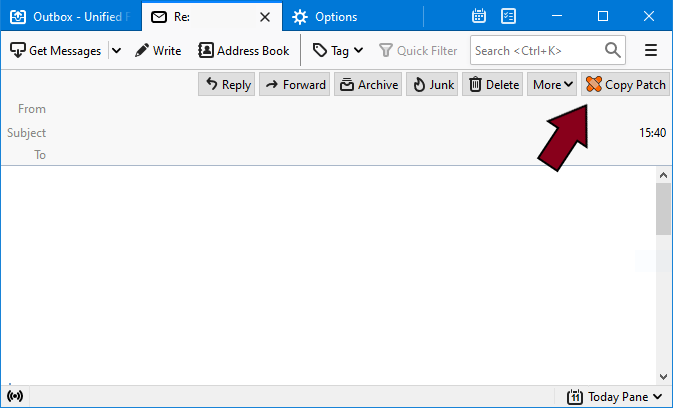

# Supported UI Elements

## Browser Action

A browser action adds a button to Thunderbird's main toolbar:


It is controlled by the `browser_action` manifest key in the extension's `manifest.json` file:

```javascript
"browser_action": {
    "default_title": "Restart",
    "default_icon" : "restart.png",
    "default_popup": "browser_popup.html"
}, 
```

If a `default_popup` is defined, a popup will be opened and the defined html page will be loaded, when the button is clicked. Alternatively, you can use the [`browserAction`](https://thunderbird-webextensions.readthedocs.io/en/latest/browserAction.html) API in your background script to interact with the button.

## Compose Action

A compose action adds a button to the toolbar of the composer window:


It is controlled by `compose_action` manifest key in the extension's `manifest.json` file:

```javascript
"compose_action": {
    "default_title": "Expand lists",
    "default_icon" : "lists.png",
    "default_popup": "compose_popup.html"
}, 
```

If a `default_popup` is defined, a popup will be opened and the defined html page will be loaded, when the button is clicked. Alternatively, you can use the [`composeAction`](https://thunderbird-webextensions.readthedocs.io/en/latest/composeAction.html) API in your background script to interact with the button.

## Message Display Action

 A message display action adds a button to the toolbar of the message view window:



It is controlled by the `message_display_action` manifest key in the extension's `manifest.json` file:

```javascript
"message_display_action": {
    "default_title": "Copy Patch",
    "default_icon" : "patch.png",
    "default_popup": "message_popup.html"
	},
```

If a `default_popup` is defined, a popup will be opened and the defined html page will be loaded, when the button is clicked. Alternatively, you can use the [`messageDisplayAction`](https://thunderbird-webextensions.readthedocs.io/en/latest/messageDisplayAction.html) API in your background script to interact with the button.

\`\`

