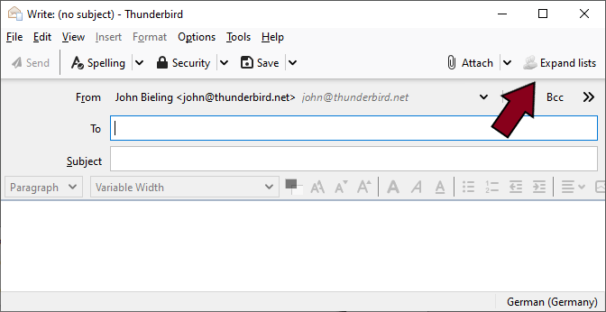
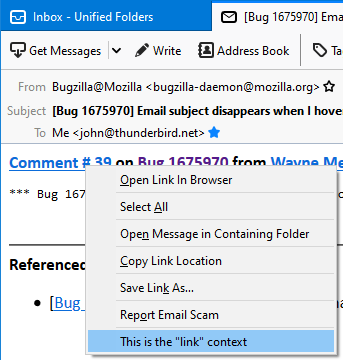
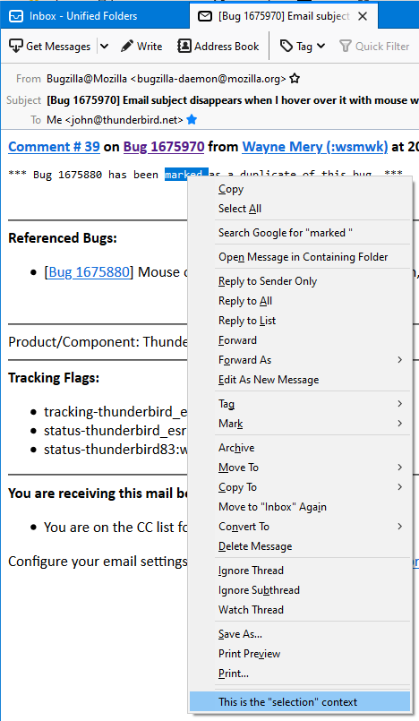

# Supported UI Elements

## Browser Action Button

A browser action adds a button to Thunderbird's main toolbar:


It is controlled by the `browser_action` manifest key in the extension's `manifest.json` file:

```javascript
"browser_action": {
    "default_title": "Restart",
    "default_icon" : "restart.png",
    "default_popup": "browser_popup.html"
}, 
```

If a `default_popup` is defined, a popup will be opened and the defined html page will be loaded, when the button is clicked. Additionally, you can use the [`browserAction`](https://thunderbird-webextensions.readthedocs.io/en/latest/browserAction.html) API in your background script to interact with the button to modify badge text, icon, title or its enabled state.

## Compose Action Button

A compose action adds a button to the toolbar of the composer window:



It is controlled by `compose_action` manifest key in the extension's `manifest.json` file:

```javascript
"compose_action": {
    "default_title": "Expand lists",
    "default_icon" : "lists.png",
    "default_popup": "compose_popup.html"
}, 
```

If a `default_popup` is defined, a popup will be opened and the defined html page will be loaded, when the button is clicked. Additionally, you can use the [`composeAction`](https://thunderbird-webextensions.readthedocs.io/en/latest/composeAction.html) API in your background script to interact with the button to modify badge text, icon, title or its enabled state.

## Message Display Action Button

 A message display action adds a button to the toolbar of the message view window:


It is controlled by the `message_display_action` manifest key in the extension's `manifest.json` file:

```javascript
"message_display_action": {
    "default_title": "Copy Patch",
    "default_icon" : "patch.png",
    "default_popup": "message_popup.html"
	},
```

If a `default_popup` is defined, a popup will be opened and the defined html page will be loaded, when the button is clicked. Additionally, you can use the [`messageDisplayAction`](https://thunderbird-webextensions.readthedocs.io/en/latest/messageDisplayAction.html) API in your background script to interact with the button to modify badge text, icon, title or its enabled state.

## Menu Items

The [`menus`](https://thunderbird-webextensions.readthedocs.io/en/latest/menus.html) API allows modifying Thunderbird's menus by adding or overriding menu items. The menu items can be added to different menus based on the provided `context` type. The following values are currently supported:

| Context | Description |  |
| :--- | :--- | :--- |
| tab | Context menu of a tab ribbon. |  |
| link | Context menu of a link in a message display tab. |  |
| selection | Context menu of selected text in a message display tab. |  |
| message\_list | Context menu in the message list. |  |
| folder\_pane | Context menu in the folder pane. |  |
| page | Context menu in a message display page, if its not the context menu of a selection, a link or image etc. |  |

\`\`

